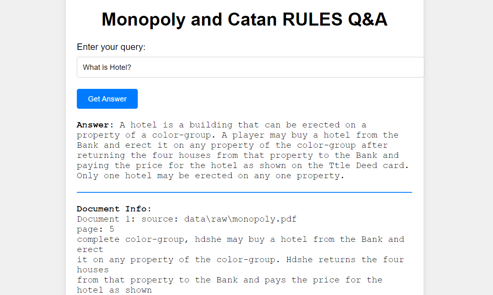

https://www.linkedin.com/in/matija-sever-2641741bb
# Monopoly and Catan Rules Q&A

This project is a Question & Answer (Q&A) web application that allows users to ask questions about the rules of Monopoly and Catan games. The application uses document retrieval and language generation techniques to provide answers based on the official rulebooks.



## Features

- **Interactive Q&A Interface**: Users can input queries related to Monopoly and Catan rules and receive detailed answers.
- **Document Retrieval**: The application retrieves relevant sections of the rulebooks to provide contextually accurate answers.
- **Answer Generation**: Uses language models to generate human-readable answers based on the retrieved documents.

## How It Works

1. **Document Loading**: The application loads and processes PDF documents of the Monopoly and Catan rulebooks.
2. **Text Chunking**: The documents are split into smaller text chunks to enable more efficient retrieval.
3. **Embedding Generation**: Each text chunk is converted into embeddings using a language model, allowing for efficient similarity searches.
4. **Document Retrieval**: When a user asks a question, the system retrieves the most relevant text chunks from the pre-processed documents.
5. **Answer Generation**: The retrieved chunks are used to generate a coherent answer to the user's question.

## Running the Application

### Prerequisites

- [Docker](https://www.docker.com/products/docker-desktop) installed on your machine.

### Steps to Run

1. **Clone the repository**:

    ```bash
    git clone https://github.com/matijasev888/langchain_rag_qa.git
    cd your-repo
    ```

2. **Build the Docker image**:

    ```bash
    docker-compose -f docker/docker-compose.yml build
    ```

3. **Start the application**:

    ```bash
    docker-compose -f docker/docker-compose.yml up
    ```

4. **Access the application**:

    Open your web browser and go to `http://localhost:5000`.

### Stopping the Application

- To stop the application, press `Ctrl + C` in the terminal where Docker Compose is running.
- To remove the containers, run:

    ```bash
    docker-compose -f docker/docker-compose.yml down
    ```

## Project Structure

- **api/**: Contains the Flask app and HTML templates.
- **config/**: Configuration files, including environment variables.
- **data/**: Contains raw, processed, and embedded data.
- **docker/**: Docker configuration files.
- **src/**: Source code for the application, including document processing, retrieval, and generation logic.
- **tests/**: Script tests for the various components of the application.
